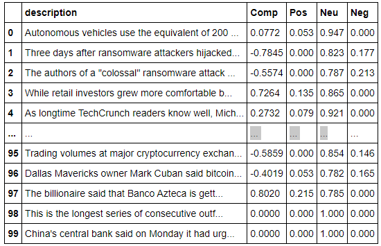

### UNIT 12 - TALES FROM THE CRYPTO

## Questions:

Q: Which coin had the highest mean positive score?

A: BTC = 0.074

Q: Which coin had the highest compound score?

A: ETH = 0.861

Q. Which coin had the highest positive score?

A: BTC = 0.352

________________________________________________________

# BTC Sentiment

________________________________________________________

# ETH Sentiment

________________________________________________________

# BTC Top Bigrams

________________________________________________________

# ETH Top Bigrams

________________________________________________________

# BTC Word Cloud

________________________________________________________

# ETH Word Cloud

